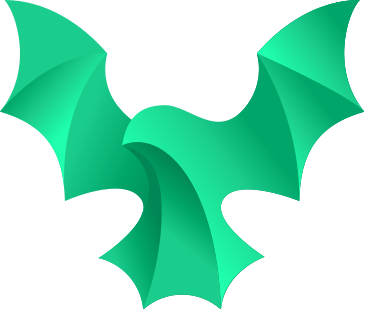

<h2 align="center">
  <br>
  
  <p>Dracodex</p>
</h2>

<p align="center">
  An React App to view and manage (i.e. edit, remove and create) a list of Dragons 
</p>

<p align="center">
  <a href="#get-started">Get Started</a> |
  <a href="#credentials">Credentials</a> |
  <a href="#credentials">Builded with</a>
</p>

## Get Started

### via NPM

```bash
# to install
npm install

# to run
npm run dev

# to build
npm run build
```

## Credentials

To access the application use the following credentials

```yaml
username: admin
password: admin
```

## Builded with

- ⚡️[Vite](https://vitejs.dev/) v2.9
- ⚛️[React](https://reactjs.org/) v18
- 💅[Styled Components](https://styled-components.com/) v5.3
- ▶️[React Router](https://reactrouter.com/) v6
